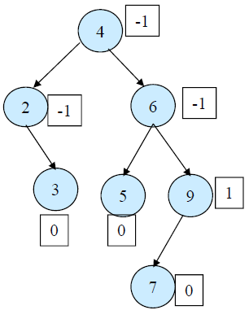
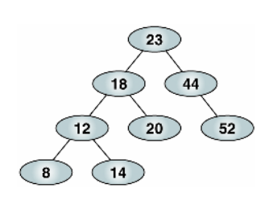
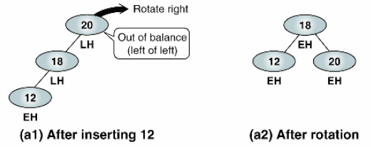
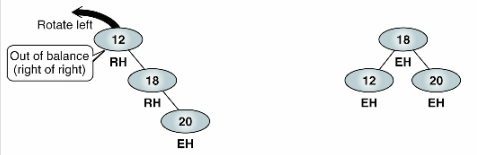
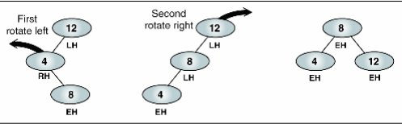

# AVL 트리

균형잡힌 트리를 만드는 방법중하나이다. 삽입, 삭제 연산중에 밸런스가 무너진 부분을 인위적으로 조작해서 트리의 높이 균형이 항상 양옆 서브트리 높이의 차가 2이상이 되지 않도록 만드는 트리를 말한다.

위 사진의 노드의 옆에 붙어 있는 네모칸들은 모두 BF ( Balanced Factor) 를 의미한다. Balanced Factor가 무너진 부분을 LL RR RL LR 등의 움직임으로 조절해서 그래프 팩터를 맞춰준다 . 예를 들어서

이런 트리가 있다고 가정하자. 이 트리는 트리라고 할 수 없을 정도로 밸런스가 무너져있다.

AVL트리는 삽입 삭제를 하는 연산 도중에 트리 배치를 인위적으로 조작하여

위와 같이 밸런스가 잡힌 트리를 만든다.

# LL (left of left)

Out of Balance ( left of left )

위의 경우는 왼쪽 밸런스가 완전히 무너지고 오른쪽 밸런스로 치우쳐진 경우이다.

방법은 간단하다. 그림처럼 트리 루트를 오른쪽으로 회전한다. 20번 트리를 18번 트리의 오른쪽 자식노드로 배치하면 된다.

# RR (right of right)

RR은 LL의 반대방향으로 로테이션을 돌리면 된다.

# RL

우선 첫번째 왼쪽 노드를 왼쪽으로 좌회전 시켜 LL과 같은 그림으로 만든다.

그후 LL 이동을 통해서 밸런스 트리를 만든다.

# RR

RL의 반대로 움직이면 된다.

# 구현시 유의사항

AVL 트리의 밸런스를 잡는 움직임은 트리의 삽입, 삭제의 경우에 발생한다.
삽입 삭제는 이미 있는 트리의 리프노드에서 일어난다. 삽입 삭제가 일어날 때 마다 매번 BF (Balanced Factor) 를 감지해야하고, BF 수치에 따라 올바른 LL , RR , RL , LR 알고리즘을 선택해야한다.

# 출처 
zerocho 님 블로그 (https://www.zerocho.com/category/Algorithm/post/583cacb648a7340018ac73f1)
