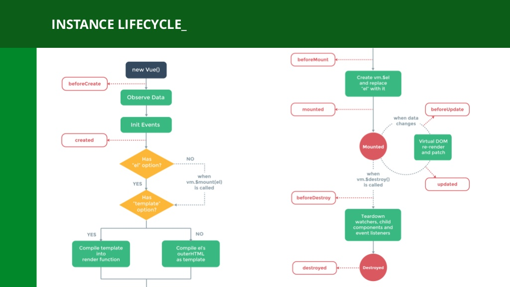

2장 내용을 생각나는 대로 정리하는장.
```html
    <div id="app">
        <p>{{message}}</p>
        <ol>
            <li v-for="item in list">{{item}}</li>
        </ol>
        <button v-on:click="handleClick">Click</button>
        <input v-model="message">
        <p v-if="show">Hello Vue.js!</p>
        
        <button v-on:click="show=!show">변경하기</button>
        <transition>
            <p v-if="show">Hello. Vue.js</p>
        </transition>
    </div>

    <script src="https://cdnjs.cloudflare.com/ajax/libs/vue/2.6.10/vue.common.dev.js"></script>
    <script src="main.js">
```

```js
var app = new Vue({
    el:'#app',
    data:{
        message:'HelloVue!',
        list:['사과','바나나','멍개'],
        show:false,
    },
    methods:{
        handleClick:function(event){
            alert(event.target);
        }
    },

    computed:{
        computedMessage:function(){
            return this.message +'!';
        },
    },

    //라이프 사이클 훅
    created:function(){
        console.log('created');
    },

    beforeCreate:function(){

    },
    
    beforeMount:function(){

    },
    mounted:function(){

    },
    beforeUpdate:function(){

    },
    updated:function(){
    
    },
    beforeDestroy:function(){

    },
    destroyed:function(){

    },
    errorCaptured:function(){
        
    }
});
```
뭔가 길다.

우선 html 코드먼저 설명해야겠다.

div , id가 app인 곳이 우리 Vue 인스턴스가 마운트 되는 곳이다. Vue의 el과 app의 이름이 같다. Vue는 id가 일치하는 곳을 찾아 자동으로 마운트해준다.

{{temp}} 로 쌓여있는 곳이 데이터 영역이다. Vue 인스턴스의 data 값이 해당 영역으로 같이 마운트된다. Vue 인스턴스 내부의 데이터가 변경되면 연동되어 HTML DOM내부의 text 값도 변경된다.

Vue의 methods 에는 자바스크립트 함수가 들어간다. 
```html
<button v-on:click="handleClick"> gd</button">
``` 

부분을 보면 v-on:click에 handleClick 메소드가 바인딩되어서 클릭 이벤트로써 바인딩 되어진다.

v- 접두사가 부튼 것들은 뷰에서 지원하는 디렉티브라는 특수한 기능이다.

v-for 의 경우, item in list 즉, Vue 인스턴스 내부의 데이터에서 list 필드의 객체를 하나씩 item으로 꺼내와 바인딩해서 펼쳐놓는다.

v-if 의경우 지정된 데이터의 bool 값에 따라, 해당 DOM을 만들거나 만들지 않는다. 그런 특수하고 펼리 한 기능들을 제공한다.

Vue 인스턴스 내부의 computed는 바인딩 되지 않는 함수를 정의할때 쓰인다. 리액티브 데이터 속성이 변하면, computed도 미리 값을 변환하여

값을 캐싱하고있는다 호출 하지 않아도 자동으로 연산하고 있다는 뜻.

created 필드부터 아래까지는 모두 vue의 라이프 사이클 훅이다.

created와 mounted가 중요한대 . created는 뷰 인스턴스가 생긴시점 . mounted는 vue와 우리 웹페이지와 마운트가 모두 완료되 DOM이 완성된 시점이다.

beforeCreate = 인스턴스가 생성되고 리액티브 초기화 해야할 시점
created = 인스턴스 생성이 완료되고 mounted로 넘어가는 시점
mounted = 마운트가 모두 완료된 후
beforeMounted = 마운트 하기 직전
beforeUpdate = 업데이트 이전 (데이터 변겨되기 직전)
updated = 업데이트가 완료된 후
beforeDestroy = Vue 인스턴스 제거 전
destroyed = Vue 인스턴스 완벽제거
errorCaptured = 오류 캡쳐시 실행

이건 천천히 접근하면서 느껴보는것이 좋을것 같다.

아래 사진은 LifeCycle의 전체적 흐름이다.

methods 필드는 애플리케이션에 사용되거나 바인딩 되는 메서드들을 넣는 곳이다. 

보통 new Vue()는 한개만 만들고, 컴포넌트는 UI로 구축한다. 무슨 의미지?


